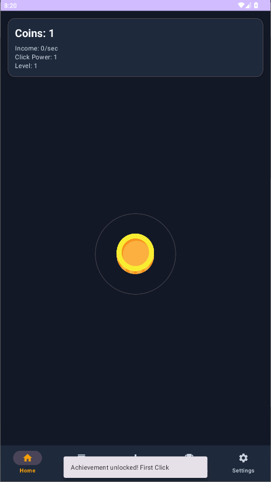
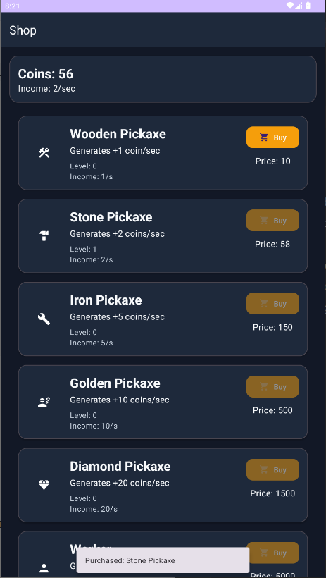
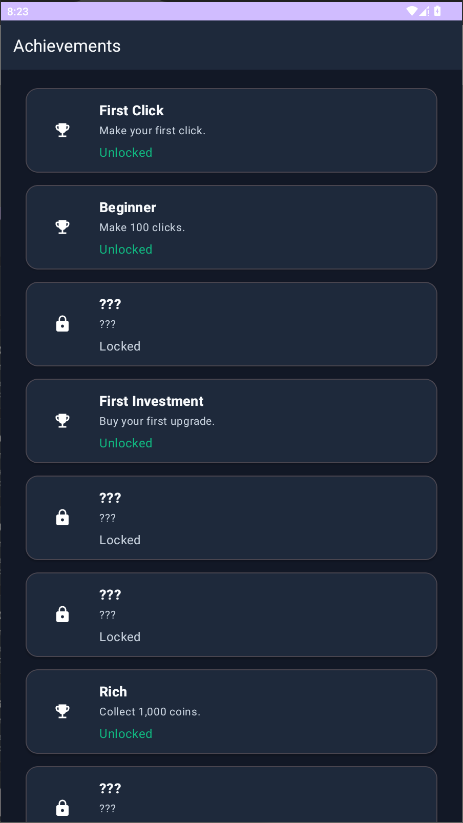
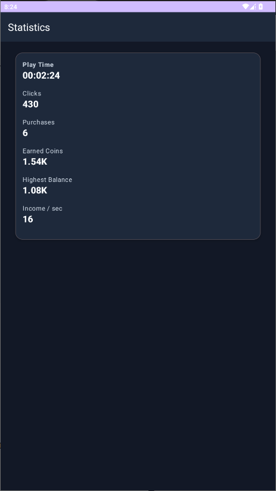
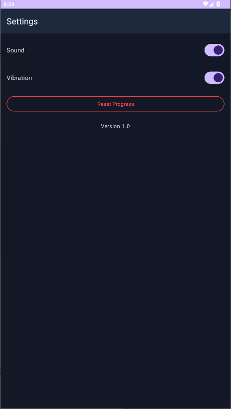
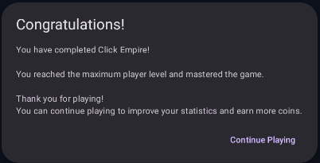

# Click Empire

Click Empire is an **Android Clicker / Idle game** where players earn coins, purchase upgrades, unlock achievements, and build their own virtual empire.

## Features

* Coin clicking mechanic
* Passive income system
* 20 upgradable items
* 15 achievements
* Player level and experience system
* Detailed game statistics
* Offline income
* Automatic game saving
* Sound effects and vibration support
* Reset progress feature
* Game completion system

## Technologies

* Java 17
* Android SDK
* AndroidX
* Material Design 3
* View Binding
* RecyclerView
* SharedPreferences
* Gson
* Gradle

## Architecture

The project follows the **MVC (Model–View–Controller)** architecture.

### Model

Contains the game's data and business logic.

Examples:

* Player
* Upgrade
* Achievement
* Statistics
* Settings

### View

Responsible for the user interface.

Examples:

* MainActivity
* ShopActivity
* AchievementActivity
* StatisticsActivity
* SettingsActivity

### Controller

Handles the game logic and communication between models and views.

Examples:

* MainController
* ShopController
* AchievementController
* StatisticsController
* GameCompletionController

## Demo

A gameplay demonstration is available in the `demo/` directory.

🎮 Gameplay video: `demo/click_empire_demo.mp4`

## Screenshots

Screenshots are available in the `screenshots/` directory.

```text
screenshots/
├── main_screen.png
├── shop.png
├── achievements.png
├── statistics.png
├── settings.png
└── game_completed.png
```

### Main Screen



### Shop



### Achievements



### Statistics



### Settings



### Game Completed



## Installation

1. Clone the repository:

```bash
git clone https://github.com/Vitalik1800/ClickEmpire.git
```

2. Open the project in Android Studio.

3. Wait for Gradle synchronization.

4. Build and run the application on an emulator or an Android device.

## Building the Release Version

Generate a signed release APK using Gradle:

```bash
./gradlew assembleRelease
```

The generated APK will be located at:

```text
app/build/outputs/apk/release/
```

## Requirements

* Android 8.0 (API 26) or higher
* Java 17
* Android Studio Narwhal or newer

## License

This project is licensed under the **MIT License**.

## Author

**Vitaly Semchyshyn**

2026
